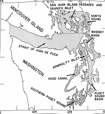

```{r setup, include=FALSE}
knitr::opts_chunk$set(echo = FALSE)
```

---
title: "Ratfish_markdown"
output: html_document
---
##Spotted ratfish (_hydrolagus colliei_)

*Abundant demersal fish in Puget Sound

*Associated with benthos and sediment

*Diel vertical migration

*Minimal research on ecology


##Methods
* WDFW has ~1500 trawls over 20 years
* Conducted at same time of year
* Measured total biomass at each site


`

##Data

```{r}
ratfish_data <- read.csv("../data/Copy of JonMcLean_Ratfish_Tow_Location_Densities(4824).csv")
head(ratfish_data)

```


```{r, echo = FALSE}
library(tidyverse)
```

##Issues with the data
*Latitude and longtitude values had too many decimal places

*Rounded down to one decimal place

*Mutated a new column onto the data table
```{r, echo=TRUE}
ratfish_data_rounded <- mutate(ratfish_data, rounded_latitude = round(StartLatitude_DD, digits = 1), rounded_longitude = round(StartLongitude_DD, digits = 1)) 
```


##Latitude graph
```{r, echo = FALSE}
ggplot(ratfish_data_rounded, aes(rounded_latitude, Ratfish_BiomassDensity.kg.ha.)) +
  geom_bar(stat = "summary", fun.y = "mean") +
  theme_classic() +
  labs(x = "latitude", y = "Ratfish Biomass", title = "Ratfish Biomass and Latitude")
  

```


##Longtitude graph
```{r, echo = FALSE}
ggplot(ratfish_data_rounded, aes(rounded_longitude, Ratfish_BiomassDensity.kg.ha.)) +
  geom_bar(stat = "summary", fun.y = "mean") +
  theme_classic() +
  labs(x = "Longitude", y = "Ratfish Biomass", title = "Ratfish Biomass and Longitude")


```
